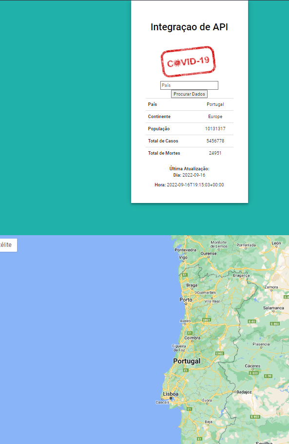

# API_Grupo2

Grupo
Alexandra Souza
Mônica Teixeira
Afonso Carvalho
Cláudio Correia

Trabalho sobre incorporações de API , neste trabalho incorporamos a API de tradução e a do COVID 19 sendo que a mesma
só funciona se escrevermos os nomes em inglês, para isso usamos a API tradução para traduzir de português para inglês.
Adicionamos também 2 API's , do geocode maps para transformar uma morada em geoposição (latitude e longitude) e API 
google maps onde pusemos essa informação.

